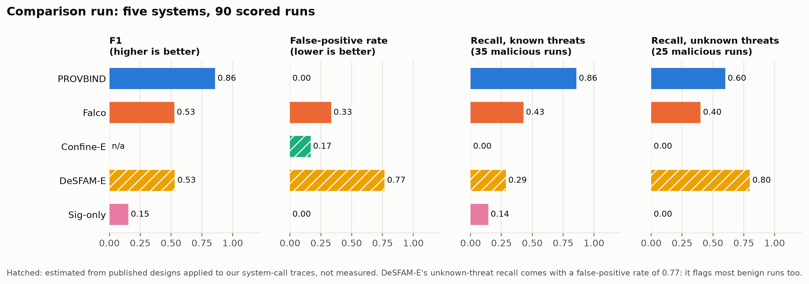
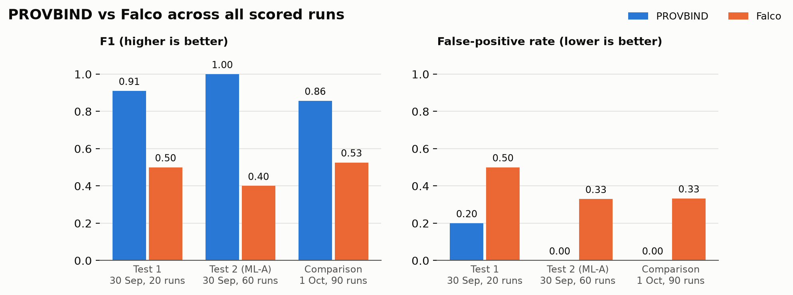
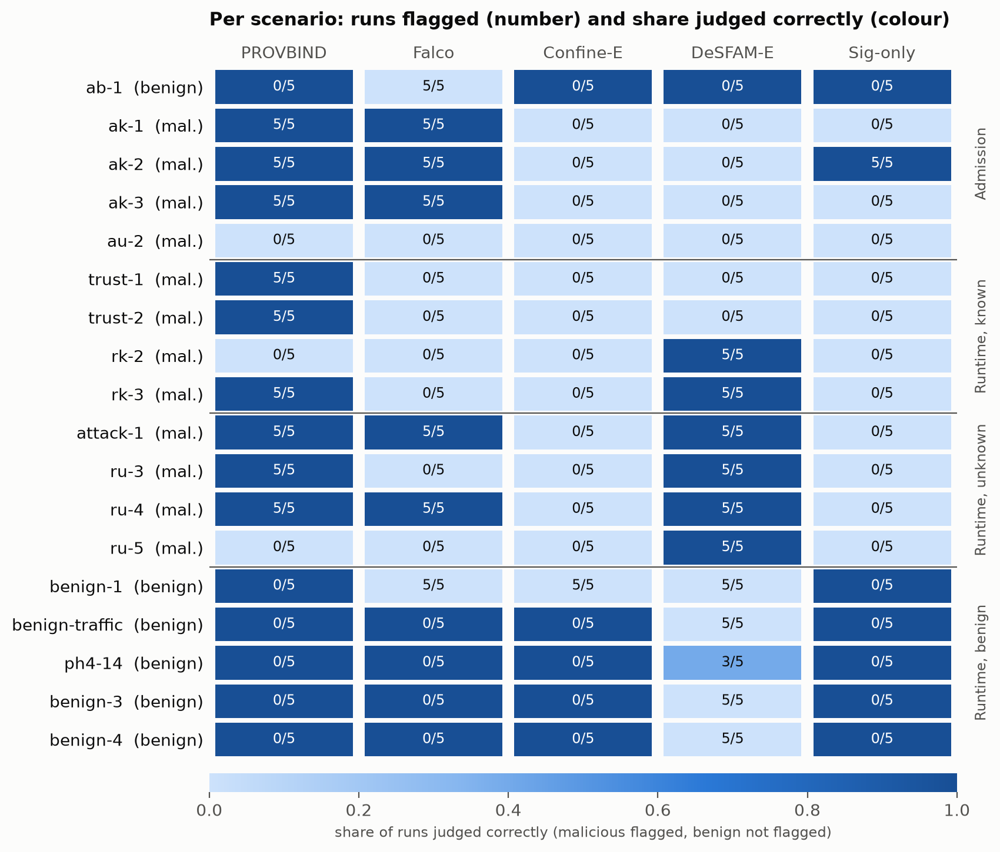
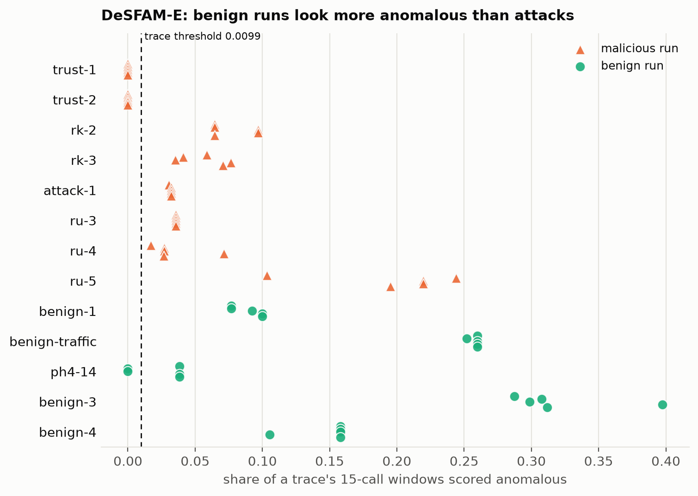
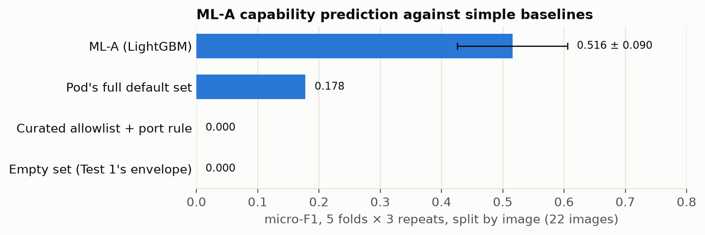

# PROVBIND comparison run: Role 1 results, 1 October 2026

**From:** Role 1 (testbed and evaluation) · **For:** Korn (Role 2), the team and the supervisor ·
**Run:** `scripts/comparison-run.sh` with `ROUNDS=5 TRACE=1` on the demo VM (Ubuntu 24.04, kernel 7.0,
kind, Tetragon, Falco), 30 Sep to 1 Oct 2026 · **Bundle:** `provbind-results-20261001-2111.tgz`
(`results/`, `ground_truth.csv`, `alerts.jsonl`, `falco.jsonl`, `logs/`; no traces, no keys).

The procedure and the scenario grid are in `docs/COMPARISON-RUN.md`. This note gives the numbers, the
known/unknown breakdown, the fixes the estimated baselines needed after the run, and the limits.

## 0. Headline

90 scored runs: 18 scenarios × 5 rounds, 60 malicious and 30 benign.

| System | Kind | TP | FP | FN | TN | Precision | Recall | **F1** | **FPR** | Attribution |
|---|---|---|---|---|---|---|---|---|---|---|
| **PROVBIND** | measured | 45 | 0 | 15 | 30 | 1.00 | 0.75 | **0.86** | **0.00** | 3 |
| Falco | measured | 25 | 10 | 35 | 20 | 0.71 | 0.42 | 0.53 | 0.33 | 1 |
| Confine-E | estimated | 0 | 5 | 60 | 25 | 0.00 | 0.00 | — | 0.17 | 0 |
| DeSFAM-E | estimated | 30 | 23 | 30 | 7 | 0.57 | 0.50 | 0.53 | 0.77 | 1 |
| Sig-only | derived | 5 | 0 | 55 | 30 | 1.00 | 0.08 | 0.15 | 0.00 | 0 |

PROVBIND has the highest F1 and no false positives. Its 15 misses are exactly the three scenarios the
design said it would miss: rk-2 (kernel-CVE shape, the complementary case), ru-5 (credential read, its
documented gap) and au-2 (a build step adds an undeclared program; only a weak signal).

PROVBIND against Falco across all three scored runs (30 September Test 1 and Test 2, this run):

## 1. Per scenario (flagged runs / 5)

| Scenario | Grid | Truth | PROVBIND | Falco | Confine-E | DeSFAM-E | Sig-only |
|---|---|---|---|---|---|---|---|
| ab-1 | A-B1 | benign | 0 | 5 | 0 | 0 | 0 |
| ak-1 | A-K1 | known | 5 | 5 | 0 | 0 | 0 |
| ak-2 | A-K2 | known | 5 | 5 | 0 | 0 | 5 |
| ak-3 | A-K3 | known | 5 | 5 | 0 | 0 | 0 |
| au-2 | A-U2 | unknown | 0 | 0 | 0 | 0 | 0 |
| trust-1 | R-K1 | known | 5 | 0 | 0 | 0 | 0 |
| trust-2 | — | known | 5 | 0 | 0 | 0 | 0 |
| rk-2 | R-K2 | known | 0 | 0 | 0 | 5 | 0 |
| rk-3 | R-K3 | known | 5 | 0 | 0 | 5 | 0 |
| attack-1 | R-U1 | unknown | 5 | 5 | 0 | 5 | 0 |
| ru-3 | R-U3 | unknown | 5 | 0 | 0 | 5 | 0 |
| ru-4 | R-U4 | unknown | 5 | 5 | 0 | 5 | 0 |
| ru-5 | R-U5 | unknown | 0 | 0 | 0 | 5 | 0 |
| benign-1 | B1 | benign | 0 | 5 | 5 | 5 | 0 |
| benign-traffic | B2 | benign | 0 | 0 | 0 | 5 | 0 |
| ph4-14 | B3 | benign | 0 | 0 | 0 | 3 | 0 |
| benign-3 | B4 | benign | 0 | 0 | 0 | 5 | 0 |
| benign-4 | B5 | benign | 0 | 0 | 0 | 5 | 0 |

Every scenario gave the same result in all 5 rounds, except DeSFAM-E on ph4-14 (3/5).

## 2. Known vs unknown threats (recall)

Known: ak-1, ak-2, ak-3, trust-1, trust-2, rk-2, rk-3 (35 runs). Unknown (zero-day shaped): au-2,
attack-1, ru-3, ru-4, ru-5 (25 runs).

| System | Known | Unknown | Admission (20 malicious) | Runtime (40 malicious) | FPR admission (5) | FPR runtime (25) |
|---|---|---|---|---|---|---|
| **PROVBIND** | **30/35 (0.86)** | **15/25 (0.60)** | 15/20 | 30/40 | 0/5 | 0/25 |
| Falco | 15/35 (0.43) | 10/25 (0.40) | 15/20 | 10/40 | 5/5 | 5/25 |
| Confine-E | 0/35 (0.00) | 0/25 (0.00) | 0/20 | 0/40 | 0/5 | 5/25 |
| DeSFAM-E | 10/35 (0.29) | 20/25 (0.80) | 0/20 | 30/40 | 0/5 | 23/25 |
| Sig-only | 5/35 (0.14) | 0/25 (0.00) | 5/20 | 0/40 | 0/5 | 0/25 |

**Reading it:**
- **Known threats.** PROVBIND catches every supply-chain one: advisory before and after deploy, a revoked key before and after deploy, an
  unsigned image, library injection. Sig-only catches only the unsigned image. Falco catches none of
  the trust scenarios.
- **Falco's admission "detections" are not detections.** It fires 5/5 on the clean deployment (ab-1)
  too: the rules match pod start-up activity, not a check of the image. On admission it cannot tell good from
  bad.
- **Unknown threats.** PROVBIND catches the three that leave the envelope (drop and execute, an undeclared
  connection, a replaced binary) and misses the two the design names as limits (ru-5, au-2).
- **DeSFAM-E's unknown-threat recall (0.80) is not meaningful.** It flags 23 of 25 benign runtime runs,
  and benign runs score *more* anomalous than attacks (Section 4). It flags almost everything that does
  not look like its training traffic.
- **Attribution.** Only PROVBIND names the package, its image layer and the builder (level 3).

## 3. The estimated baselines needed seven fixes after the run

The first analysis flagged every trace for Confine-E and DeSFAM-E, benign ones included. The run itself
was fine; the estimator inputs were not. Each fix is in `eval/baselines/` with a unit test (commits
`16cd159` and `3fca1ce` on `claude/zen-hypatia-pyrg25`). The re-analysis used the same saved traces;
nothing was re-run. **Korn, please review these, especially fix 7, which is a judgement call.**

1. bpftrace's status line `Attaching 367 probes...` was read as a system call. Non-syscall lines are now
   skipped.
2. Kernel tracepoint names differ from the syscall table (`newfstat`, `newuname`, `sendfile64`…). They
   are now renamed.
3. libc's own start-up and exit calls (`arch_prctl`, `rseq`, `exit_group`…) never appear as imports.
   A documented `LIBC_RUNTIME` set is now added whenever an ELF file exists.
4. `export_binaries.sh` copied only the closure (5 files). It now also copies every file mapped into
   the pod's processes (33 files, including Python's extension modules).
5. Calls made by the container runtime (`runc:[1:CHILD]` entering the pod for `kubectl exec`) were
   judged as the app's. runc installs the seccomp filter only just before it runs the command, so
   these calls are now dropped.
6. The function-to-syscall map knew only categorised names, so `close_range`, `fcntl64` and the like
   counted as unexpected calls. Every x86-64 syscall name and glibc's `foo64` variants now map.
7. DeSFAM-E's per-window threshold (99.5th percentile) lets 0.5% of benign windows through by
   construction, so every long trace was flagged. A trace now counts as anomalous when the share of
   anomalous windows in it is higher than the benign baseline's own share. That baseline share is
   measured leave-one-out over the 3 baseline traces (threshold 0.0099). `--trace-rule window` restores
   the raw rule.

## 4. What the baselines show, and why

**Confine-E (recall 0, FPR 0.17).** None of the runtime attacks uses a system call that the Python app
doesn't already need, so a static allow list lets every one through. The 5 false positives are benign-1:
`ls`, run through `kubectl exec`, calls `prctl`, which is not on the app's list. A real Confine profile
would break that command too. This matches Confine's own aim: shrinking the kernel attack surface, not
detecting behaviour.

**DeSFAM-E (FPR 0.77).** Share of anomalous windows per trace (training: 2,378 windows of load-generator
traffic):

| | Share of anomalous windows |
|---|---|
| benign runs (benign-1, -3, -4, -traffic) | 0.08 – 0.40 |
| ph4-14 | 0.00 – 0.04 |
| attacks (attack-1, rk-3, ru-3, ru-4) | 0.02 – 0.08 |
| rk-2, ru-5 | 0.06 – 0.24 |

No threshold separates benign from malicious here. The baseline contains only the load generator, so
DNS lookups, volume writes and `kubectl exec` look new. With a representative baseline DeSFAM reports
FPR 0.016 (its paper; shown beside the estimate in `COMPARISON.md`). Our number shows how sensitive the
approach is to the baseline; it is not a measure of DeSFAM's best case. The paper should call Confine
and DeSFAM **complementary**: they guard the kernel boundary, PROVBIND guards the supply chain.

## 5. Limits

- Small and designed by us: 18 scenarios re-created harmlessly from behaviours in the Datadog dataset;
  no real malicious sample was used (Test Plan §12.4). The scores show the mechanisms work end to end;
  they don't measure performance on unseen real attacks.
- Confine-E and DeSFAM-E are estimates: published rules applied to our traces, not the original systems.
  Their admission-row results are "not detected" by design (no admission check), and they were not
  traced there.
- attack-2 (R-U2) was not in this run. ML-B is trained, but by Role 3 on Role 3's VM, for the image
  `sha256:4ce21957…`; a model is tied to its image digest, and this run's image (`sha256:fcca765f…`,
  rebuilt with the Tier 2 routes) has none. Role 3's run is the R-U2 evidence (Section 7).
- One VM; VirtualBox time sync was stopped for the run, and Falco was restarted beforehand.

## 6. Time to alert

PROVBIND trust alerts (30 alerts, from `results/latency.json`): median **1.2 s**, mean 3.2 s from the
trust event (advisory written or key revoked) to the alert.

## 7. Coverage of the capability test plan (Role 1 tests)

The comparison grid ran in full except R-U2. Against the wider plan (`tests/capability/registry.json`):

| Status | Tests |
|---|---|
| Covered by this run | EV-01, EV-02, E2E-01, E2E-02, E2E-05 (ru-4), E2E-06 (rk-3), E2E-08 (ru-3), E2E-10 (ak-2), E2E-11 (trust-1, trust-2), EV-06 in part (stage per scenario) |
| Covered on 30 September | E2E-07 (ML-A Test 2), E2E-12 (tamper-1), MLA-03, EV-03 in part (D_cap ablation) |
| Covered on Role 3's VM (1 October) | E2E-03 in-envelope burst (attack-2): ML-B raised 3, 5 and 5 `D_beh` in its 3 runs, 0 in benign rows; held-out FPR 0.0071 (MLB-03 to 05 pass, `node/ROLE3_STATUS.md`). Falco was not captured there, so it is not part of this comparison |
| Not run | E2E-04 relocated binary, E2E-09 install-time payload, the rest of EV-03, EV-07 ML-C baseline |
| P2, not run | EV-04 SynthChain, EV-05 low-and-slow mimicry |
| To confirm | CF-02, CF-03, CF-04, CF-06 (filter measurements) |

Every P0 test is covered: E2E-03 by Role 3's run, the rest here or on 30 September. Putting attack-2 into
this five-system comparison would need an ML-B model for this run's image: our own D2 (about 9.5 h of
benign load at the app's rate, `ml/data/mlb/README.md`) and then the runtime rounds again with `--mlb`.

## 8. Figures

`docs/figures/` (PNG and SVG), made by `python -m eval.plots` (needs `matplotlib`):
`comparison-metrics`, `comparison-per-scenario`, `desfam-anomaly-fractions`, `scored-runs-history`
(all three scored runs) and `mla-capabilities` (ML-A, 30 September). The comparison figures are drawn
from `docs/figures/data/comparison-2026-10-01.json`, this run's tables; after a new run, draw them from
the run's own files: `python -m eval.plots --comparison run/results/COMPARISON.json --desfam
run/results/desfam.json --out docs/figures`.

## 9. Open items

- Korn: review the seven estimator fixes; decide whether DeSFAM-E should get a second benign baseline
  of benign-scenario activity (separate runs, not scored; about 20 minutes on the VM).
- The raw result files (the bundle above) are in the team share; whether to commit them to the repo is
  open.
- The P1 tests above that were not run, if the team wants them before the deadline.
- Tool versions for `testbed/VERSIONS.md`.
